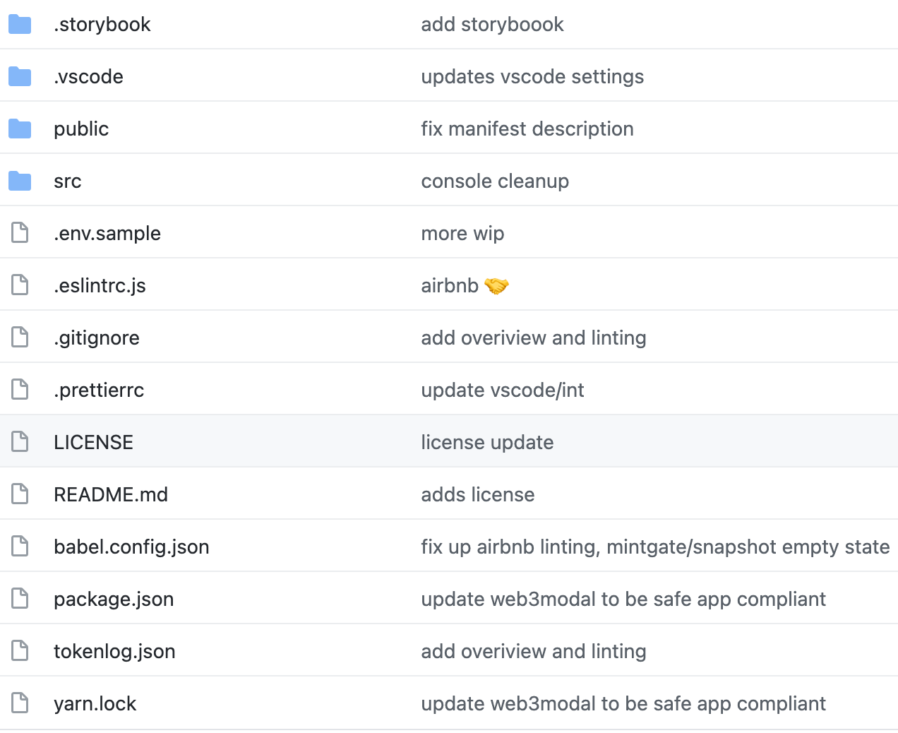

## DAOhaus Code Analysis Frontend
+ DAOhaus前端：https://github.com/HausDAO/daohaus-app（内部代号pokemol项目）
+ DAOhaus后端：https://github.com/MolochVentures/moloch/(Moloch合约代码)
+ 本文分析前端代码
### App结构
+ 这里分析整体目录结构和主要代码实现的功能。

+ 可以看到，主要目录是public、src
+ public目录是index文件、favor icon等页面文件关联内容，无业务流程，略过。
+ src目录非常多子目录，粗粗看了下，结构并不太合理，只能根据页面主要功能找到路径，再结合目录，来分析对应代码。
#### index.jsx
+ react render，应用app，注入app内容。
```
import React from 'react';
import ReactDOM from 'react-dom';

import './index.css';
import { BrowserRouter } from 'react-router-dom';
import App from './App';
import reportWebVitals from './reportWebVitals';
import { InjectedProvider } from './contexts/InjectedProviderContext';
import { CustomThemeProvider } from './contexts/CustomThemeContext';

window.onunload = () => {
  sessionStorage.clear();
};

ReactDOM.render(
  <React.StrictMode>
    <BrowserRouter>
      <CustomThemeProvider>
        <InjectedProvider>
          <App />
        </InjectedProvider>
      </CustomThemeProvider>
    </BrowserRouter>
  </React.StrictMode>,
  document.getElementById('root'),
);
```
+ 如果调试性能：reportWebVitals(console.log))，更多参考https://bit.ly/CRA-vitals
#### app.jsx
+ 应用主要文件，汇集所有关键功能代码，输出app
```
import React from 'react';
import { Switch, Route, Redirect } from 'react-router-dom';

import { UserContextProvider } from './contexts/UserContext';
import { ExploreContextProvider } from './contexts/ExploreContext';
import Hub from './pages/Hub';
import Dao from './pages/Dao';
import Explore from './pages/Explore';
import Summon from './pages/Summon';
import Register from './pages/Register';
import DaoSwitcherModal from './modals/daoSwitcherModal';
import TxInfoModal from './modals/TxInfoModal';
import FourOhFour from './pages/404';
import HubBalances from './pages/HubBalances';
```
+ 可以看到，关键的Hub：聚合功能、Dao本身管理、Explore搜索更多DAO、Summon召唤新建一个DAO等等，都有了，不一一解释，基本和首页对应，我们来探索下。
### 目录概述
+ 主要目录
#### 1 storybook
+ 独立开发React、Vue和Angular的UI组件工具，这个目录猜测是用来展示、测试UI组件的。
+ npm run storybook
+ 扩展阅读：
+ https://www.jianshu.com/p/9cb75ae50515
+ https://storybook.js.org/docs/react/get-started/introduction
+ License：GPLV3,https://www.gnu.org/licenses/gpl-3.0.txt
#### 2 vscode
+ 设置文件，不解释
#### 3 public
+ 全局静态文件
+ icon集合，index静态文件
#### 4 src
+ 主要目录文件
+ 分为几个大类
##### 入口

index.jsx

App.jsx
##### 控制部分

**routers**  

**contexts** 

**pages**       

**forms**  

##### 实现部分

**contracts**  

**graphQL**  

**services**  

**hooks**  

**components**     

##### 辅助内容

**themes**

**header**   

**content**      

**data**             

**modals**     

**stories**

**nav** 

**polls**       

**formBuilder**    

**assets** 

**staticElements**   

**utils**

##### 其他

global.css

 index.css

reportWebVitals.js

setupTests.js
### 分析路径
+ 前端分析目标是具备React基本开发能力的同学，看完本文后，能够动手修改前端页面功能，改为自己的XXXDAOClub之类的DAO建设工具（后端也要对应修改、完善）。
+ 以App.jsx为入口，描述下整体分析思路，
+ 
### 调用智能合约
+ 这里主要分析调用Moloch智能合约的过程，入口和返回参数等。
+ [欢迎认领~！issue留言即可！](https://github.com/Dapp-Learning-DAO/Dapp-Learning/issues/99)
### 新建DAO
+ 这里完整跟进一个建立新DAO的过程。
+ 新建DAO核心是合约参数传递给Moloch线上合约，然后运行，生成新建DAO的配置数据，写入链上，并且发行新建DAOToken的过程。
+ [欢迎认领~！issue留言即可！](https://github.com/Dapp-Learning-DAO/Dapp-Learning/issues/99)

### 插件系统
+ 这里分析几个插件系统运作机制：snapshot proposals、Token supply、discord消息三个，如果有新力量加入，欢迎分享、分担一部分分析工作，欢迎认领~！
+ [欢迎认领~！issue留言即可！](https://github.com/Dapp-Learning-DAO/Dapp-Learning/issues/99)

### 其他
+ DAOhaus is a no code platform for Moloch DAOs. index.html的meta content标签内容。
