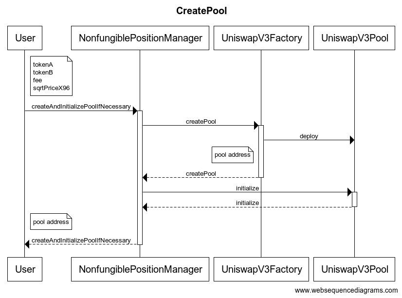

# UniswapV3 合约导读

> 本文旨在帮助大家熟悉 UniswapV3 的合约结构，梳理流程。以下内容主要参考自 [@paco0x](https://github.com/paco0x) 的系列博客[《Uniswap v3 详解》](https://liaoph.com/uniswap-v3-1/)。感谢 paco 的精彩分享，强烈推荐大家去读一读他的博客！

## 基本架构

Uniswap v3 在代码层面的架构和 v2 基本保持一致，将合约分成了两个仓库：

- uniswap-v3-core
- uniswap-v3-periphery

### core

- **UniswapV3Factory**: 提供创建 pool 的接口，并且追踪所有的 pool
- **UniswapV3Pool**: 实现代币交易，流动性管理，交易手续费的收取，oracle 数据管理。接口的实现粒度比较低，不适合普通用户使用，错误的调用其中的接口可能会造成经济上的损失。

### periphery

- **SwapRouter**: 提供代币交易的接口，它是对 UniswapV3Pool 合约中交易相关接口的进一步封装，前端界面主要与这个合约来进行对接。
- **NonfungiblePositionManager**: 用来增加/移除/修改 Pool 的流动性，并且通过 NFT token 将流动性代币化。使用 ERC721 token（v2 使用的是 ERC20）的原因是同一个池的多个流动性并不能等价替换（v3 的集中流性动功能）。

### 相关图示

- 合约关系图
  
- [合约结构图](../img/640.png)
- [Factory 结构图](./img/UniswapV3_ContractMap_Factory.png)
- [NonFungiblePositionManager 结构图](./img/UniswapV3_ContractMap_NonFungiblePositionManager.png)
- [Pool 结构图](./img/UniswapV3_ContractMap_Pool.png)

## 流程梳理

### NonfungiblePositionManager

#### CreatePool

用户首先调用 `NonfungiblePositionManager` 合约的 `createAndInitializePoolIfNecessary` 方法创建交易对，传入的参数为交易对的 token0, token1, fee 和初始价格 sqrtPrice.

- 调用`Factory.getPool(tokenA, tokenB, fee)`获取 Pool 地址

- 如果 Pool 地址为 0，说明 Pool 还未创建

  - 调用`Factory.createPool(tokenA, tokenB, fee)`，创建 Pool
    - Factory调用 `Pool.deploy` 部署Pool合约
  - 调用`Pool.initialize(sqrtPriceX96)`对 Pool 初始化

- 如果 Pool 地址不为 0 ，说明 Pool 已存在

  - 检查 Pool 的价格，若为 0,调用`Pool.initialize(sqrtPriceX96)`对 Pool 初始化

相关代码

- [createAndInitializePoolIfNecessary](./NonfungiblePositionManager.md#createAndInitializePoolIfNecessary)
- [UniswapV3Factory.getPool](./UniswapV3Factory.md#getPool)
- [UniswapV3Factory.createPool](./UniswapV3Factory.md#createPool)
- [UniswapV3Factory.deploy](./UniswapV3Factory.md#deploy)
- [UniswapV3Pool.initialize](./UniswapV3Pool.md#initialize)

xmind

- [CreatePool 程序流程图](./xmind/CreatePool.png)

#### mint

铸造代表流动性头寸的ERC721代笔返回给用户

用户调用 `Manager.mint`创建Position并添加流动性：

- Manager内部调用 `Manager.addLiquidity`
- Manager调用`Pool.mint`
  - 修改用户的position状态
  - 调用manager的mint回调函数，进行token的转帐操作
- Manager内部调用`Manager.mint`，返回`amount0` `amount1`(token0,token1 的实际注入数量)
  - 将代表相关流动性postion的ERC721代币返回给用户
  - 创建流动性头寸存入Manager
- 广播 `IncreaseLiquidity(tokenId, liquidity, amount0, amount1)`

相关代码

- [Manager.mint](./NonfungiblePositionManager.md#mint)
- [Pool.mint](./UniswapV3Pool.md#mint)
- [struct AddLiquidityParams](./NonfungiblePositionManager.md#AddLiquidityParams)
- [Manager.addLiquidity](./NonfungiblePositionManager.md#addLiquidity)

xmind

- [Mint/IncreateLiquidity 程序流程图](./xmind/Mint-IncreateLiquidity.png)

#### increaseLiquidity

用户调用 `Manager.increaseLiquidity` 向已有Position添加流动性：

- Manager内部调用 `Manager.addLiquidity`
- 从Pool中获取position最新的手续费数值
- 将手续费加到position的记录中（两种token分别记录）
- 广播 `IncreaseLiquidity(tokenId, liquidity, amount0, amount1)`

注意：添加或移除流动性都会触发Manager从Pool中更新手续费数据，但不会提取

相关代码

- [struct AddLiquidityParams](./NonfungiblePositionManager.md#AddLiquidityParams)
- [Manager.addLiquidity](./NonfungiblePositionManager.md#addLiquidity)

#### decreaseLiquidity

用户调用 `Manager.decreaseLiquidity` 移除已有Position的流动性：

- 检查入参，position现有流动性 >= 传入的流动性
- 调用`Pool.burn` 返回实际移除的流动性转换为token的数量（amount0, amount1）
- 回收用户在Pool中积累的手续费
  - 先获取Pool中手续费数值
  - 手续费增量 = Pool手续费数值 - position中记录的手续费数值
  - 将手续费增量累加到position的待取token数量中
  - 更新 position中记录的手续费数值
- 更新 position中记录的流动性
- 广播 `IncreaseLiquidity(tokenId, liquidity, amount0, amount1)`

相关代码

- [struct DecreaseLiquidityParams](./NonfungiblePositionManager.md#DecreaseLiquidityParams)
- [Manager.decreaseLiquidity](./NonfungiblePositionManager.md#decreaseLiquidity)

xmind

- [DecreaseLiquidity 程序流程图](./xmind/DecreaseLiquidity.png)

#### collect

用户调用 `Manager.collect` 回收Pool中累计的手续费收益：

- 检查入参
  - 回收手续费最大数量需要 > 0
  - 当入参recipient为0，设为本Manager合约地址
- 如果position流动性 > 0，触发Pool更新手续费相关数据的快照
  - 调用`Pool.burn`触发更新手续费相关的数据，这里数量传0，并不会真的移除流动性
  - Pool的手续费 - Manager中记录的手续费 = 手续费增量（即本次可取的手续费数量）
  - 期望取回的手续费数量 = max(手续费增量，入参的手续费最大值)
- 调用 `Pool.collect` ，Pool将手续费转给接收者，返回实际取回的手续费数量
- 更新Manager中手续费数据与Pool同步
- 广播 `Collect(params.tokenId, recipient, amount0Collect, amount1Collect)`

相关代码

- [struct CollectParams](./NonfungiblePositionManager.md#CollectParams)
- [Manager.collect](./NonfungiblePositionManager.md#collect)
- [Pool.collect](./UniswapV3Pool.md#collect)

xmind

- [CollectFee 程序流程图](./xmind/CollectFee.png)

#### burn

用户调用 `Manager.burn`，移除position，并销毁ERC721token

相关代码

- [Manager.burn](./NonfungiblePositionManager.md#burn)

xmind

- [BurnPosition 程序流程图](./xmind/BurnPosition.png)

### SwapRouter

#### exactInput

指定交易对路径，给出期望的输入数量，返回实际的交易数量。

##### 路径选择

在进行两个代币交易时，是首先需要在链下计算出交易的路径，例如使用 `ETH` -> `DAI` ：

- 可以直接通过 `ETH`/`DAI` 的交易池完成
- 也可以通过 `ETH` -> `USDC` -> `DAI` 路径，即经过 `ETH/USDC`, `USDC/DAI` 两个交易池完成交易
- token地址没有排序限制

##### 执行过程

这里流程比较多，建议配合xmind流程图梳理。

用户调用 `Router.exactInput`：

1. 将支付者payer设置为交易发起者（用户）
2. 进入while循环，对当前交易对执行具体的交易操作
3. 获取 `hasMultiplePools`
  a. `path.length >= 3 * tokenAddressLength + 2 * feeLength` 的布尔值
  b. `token + fee + token` 组成一个交易对，即 PoolKey
  c. 这里是判断是否存在1个以上的交易对，即交易是否需要中转交易（A->B->C)
4. 调用 `Router.exactInputInternal` exactInput的内部方法
  a. `recipient` 若为0，则改为本router合约地址
  b. 从交易链路 `path` 中解析出 `tokenIn`, `fee`, `tokenOut`, 即当前第一个 Pool 的关键信息，以此可计算出Pool的地址
  c. 获取 `zeroForOne` ，即 `tokenIn < tokenOut` 的布尔值
    - 在Pool中价格始终以 `y/x` 表示，这里 `address(x) < address(y)`
    - `zeroForOne` 代表的是交易的方向，即`tokenIn`是作为x还是y，`tokenOut`反之
  d. 调用 `Pool.swap` 执行实际的交易方法
    - `amountIn` 入参是 `int256` 类型，即有符号，若传负数，则表示 exactOutinput 模式，这里是 exactInput，传入的是正数
    - `priceLimit` 是交易执行的价格限制，一旦触及即停止交易。这里传0，代表以市价执行交易
    - `SwapCallbackData` 是交易回调函数
    - 在`Pool.swap`中交易是分段执行，具体细节参见其代码。swap函数在计算完实际交易量后，会先把输出token转账给接收者，然后调用回调将输入token从发送者转账到Pool合约
  e. 返回实际的输入输出交易数量
5. 根据`hasMultiplePools`判断循环是否继续
  a. true 交易路径中仍有待执行的交易对
    - 将支付者payer设为本router合约地址
    - `path`剔除掉第一个token和fee的信息，继续使用后续的token地址和fee信息组成交易对
    - 回到2继续执行
  b. false 交易完成，跳出while循环，返回 `amountOut` 实际的输出token数量
6. 最后检查交易实际的输出量是否满足用户设置的最小输出数量

相关代码

- [Router.exactInput](./SwapRouter.md#exactInput)
- [Router.exactInputInternal](./SwapRouter.md#exactInputInternal)
- [Router.SwapCallbackData](./SwapRouter.md#SwapCallbackData)
- [Pool.swap](./UniswapV3Pool.md#swap)

xmind

- [exactInput 程序流程图](./xmind/ExactInput.png)

#### exactOutput

指定交易对路径，给出期望的输出数量，返回实际的交易数量。

程序逻辑和 exactInput 类似

### flash swap

闪电贷接口，无需抵押和零信任的借贷，借贷到还贷需要在一个区块内完成。

Uniswap v3 版本中，和 v2 一样也有两种闪电贷的方式，但是是通过不同的函数接口来完成的。

- `Pool.flash` 借出和归还是同一币种
- `Pool.swap` 借出swap函数先将输出token转给接收者，再通过回调将输入token转给Pool的机制，实现了借出和归还不同币种的闪电贷

相关代码

- [Pool.flash](./UniswapV3Pool.md#flash)
- [flashswap](./UniswapV3Pool.md#flashswap)
