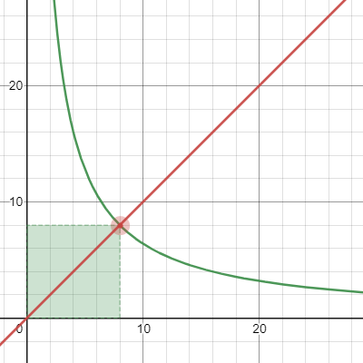

# Understand UniswapV3 whitepaper

> 关于白皮书的解读，已有很多非常棒的文章，但白皮书中的公式和相关概念还是很艰深难懂的（对于学渣来说……），这里我想尝试用比较通俗易懂的方式谈谈对白皮书的理解，希望对大家有帮助。

## xy=k

关于这个 V1 和 V2 版本的核心公式，相信大家已经很熟悉了，（不了解的小伙伴可以看这篇[Uniswap-V1-Like 用 solidity 仿写一个 uniV1](../../../basic/13-decentralized-exchange/uniswap-v1-like/README.md)）。

虽然它是很经典的 AMM 公式，但存在一个很大问题，就是资金利用率不高。

### 做市的价格区间

我们先简单回顾一下在一个流动性池子中，如何表达资产的价格。

假设有资产 X 和资产 Y，现在存在一个以 X 和 Y 资产组成的交易对池子。当我们要用资产 X 来标价 Y 的时候，`PriceY = y的数量 / x的数量`，这很容易想到。

我们在直角坐标系上，用 x 轴表示资产 X 的数量，y 轴表示资产 Y 的数量，那么将上面的式子变换可以得到 `y = p * x`，为了简化，我们用 `p` 来表示 priceY。

于是我们可以在坐标系上添加一条直线，其斜率 `y/x`，就是价格 `p`。当价格变化的时候，就是这条直线的斜率在变化。

流动性就可以用一个矩形的面积来表示。因为`k`的实际意义就是用来衡量一个池子的流动性数量，而`x*y=k`，所以池子中`资产X的数量 * 资产Y的数量 = 流动性数量`。



在上图中，资产 Y 的价格在上涨，绿色区域的面积是流动性数量 k，需要保持恒定不变，于是随着价格变化，矩形右上方端点（图中的红点）就能划出一条我们熟悉的双曲线。随着价格上涨，红点逐渐上移，矩形的高度不断变大，而宽度不断变小。当价格趋近于无穷大时，红线会无限接近和 y 轴重叠，但却不可能真正重叠，以为绿色的双曲线是不会和坐标轴相交的。所以我们的池子做市的价格上限是无穷大，同理，下限是 0（因为双曲线和 x 轴也不会相交）。

所以在 `x*y=k` 的情况下，做市的价格区间是 (0, ∞)。

### 资金利用率

价格区间(0, ∞)看起来很理想，我们的资金在任何时候（任意价格点）都能为我们赚取手续费。

但我们忽略了另一个影响收益的重要因素，那就是资金的利用率。当一个用户来用我们的池子做交易时，其交易的量相比我们的流动性来说是很小的。

假设现在池子内资产 X 和 Y 都有 8 个，那么流动性 k 为 64，而价格 p 为 1。

现在有一笔订单，用 1 个 X 来换取 1 个 Y，我们先不考虑滑点和手续费的影响，这一笔交易为我们带来的手续费收益是 `fee = 1 * 0.3%`，实际参与赚取手续费的流动性就是输入的 1 个 x（uniswap只收取输入端的手续费），这相比于总流动性是很小的，资金利用率是大约是 `1 / 64`。也就是说，我们只需要极少一部分流动性就能承载这一笔交易，而大部分流动性在交易过程只是躺在那做收益的分母而已……


回到我们的坐标系上，当用户用X换取Y的时候，价格会从低点涨到高点，红点从 `price lower` 移动到 `price upper` 的过程中，实际参与交易的流动性仅仅是橙色的矩形区域。这里为了便于查看，夸大了价格的变动区间，实际交易过程中，价格变动不会这么大，所以橙色区域是极小的。

所以提高利用率的关键是既要移除那些躺在那不干活的流动性（绿色区域），又要保证这个函数模型不变。于是我们将其换成了虚拟的流动性，即 `x_virtual` 和 `y_virtual`，而添加流动性时，只需要注入橙色区域的流动性即可。于是公式变成了如下模样：

```math
(x + x_virtual)*(y + y_virtual)=k
```


整个图形向左下方平移了，因为价格是直线的斜率，所以平移对于实际交易是没有影响的。

**前提是价格没有超出限定的区间**：
