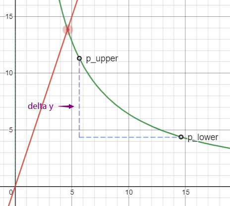
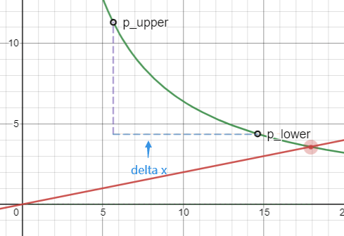

# Understand UniswapV3 whitepaper

> 关于白皮书的解读，已有很多非常棒的文章，但白皮书中的公式和相关概念还是很艰深难懂的（对于学渣来说……），这里我想尝试用比较通俗易懂的方式谈谈对白皮书的理解，希望对大家有帮助。

## xy=k

关于这个 V1 和 V2 版本的核心公式，相信大家已经很熟悉了，（不了解的小伙伴可以看这篇[Uniswap-V1-Like 用 solidity 仿写一个 uniV1](../../../basic/13-decentralized-exchange/uniswap-v1-like/README.md)）。

虽然它是很经典的 AMM 公式，但存在一个很大问题，就是资金利用率不高。

### v2 的价格区间

我们先简单回顾一下在一个流动性池子中，如何表达资产的价格。

假设有资产 X 和资产 Y，现在存在一个以 X 和 Y 资产组成的交易对池子。当我们要用资产 X 来标价 Y 的时候，`PriceY = y的数量 / x的数量`，这很容易想到。

我们在直角坐标系上，用 x 轴表示资产 X 的数量，y 轴表示资产 Y 的数量，那么将上面的式子变换可以得到 `y = p * x`，为了简化，我们用 `p` 来表示 priceY。

于是我们可以在坐标系上添加一条直线，其斜率 `y/x`，就是价格 `p`。当价格变化的时候，就是这条直线的斜率在变化。

流动性就可以用一个矩形的面积来表示。因为`k`的实际意义就是用来衡量一个池子的流动性数量，而`x*y=k`，所以池子中`资产X的数量 * 资产Y的数量 = 流动性数量`。


img01: price changing

在上图中，资产 Y 的价格在上涨，绿色区域的面积是流动性数量 k，需要保持恒定不变，于是随着价格变化，矩形右上方端点（图中的红点）就能划出一条我们熟悉的双曲线。随着价格上涨，红点逐渐上移，矩形的高度不断变大，而宽度不断变小。当价格趋近于无穷大时，红线会无限接近和 y 轴重叠，但却不可能真正重叠，以为绿色的双曲线是不会和坐标轴相交的。所以我们的池子做市的价格上限是无穷大，同理，下限是 0（因为双曲线和 x 轴也不会相交）。

所以在 `x*y=k` 的情况下，做市的价格区间是 (0, ∞)。

### 资金利用率

价格区间(0, ∞)看起来很理想，我们的资金在任何时候（任意价格点）都能为我们赚取手续费。

但我们忽略了另一个影响收益的重要因素，那就是资金的利用率。当一个用户来用我们的池子做交易时，其交易的量相比我们的流动性来说是很小的。

假设现在池子内资产 X 和 Y 都有 8 个，价格 p 为 1。

现在有一笔订单，用 1 个 X 来换取 1 个 Y，我们先不考虑滑点和手续费的影响，这一笔交易为我们带来的手续费收益是 `fee = 1 * 0.3%`，实际参与赚取手续费的流动性就是输出的 1 个 y，这相比于总流动性是很小的，在这一笔交易中，资金利用率是大约是 `1 / 8`。也就是说，我们只需要极少一部分流动性就能承载这一笔交易，而大部分流动性在交易过程中只是躺在那做收益的分母而已……


img02: liquidity rate

回到我们的坐标系上，当用户用 X 换取 Y 的时候，价格会从低点涨到高点，红点从 `p_lower` 移动到 `p_upper` 的过程中，实际参与交易的流动性仅仅是橙色的矩形区域。这里为了便于查看，夸大了价格的变动区间，实际交易过程中，价格变动不会这么大，所以橙色区域是极小的。

所以提高利用率的关键是既要移除那些躺在那不干活的流动性（绿色区域），又要保证这个函数模型不变。于是我们将其换成了虚拟的流动性，即 `x_virtual` 和 `y_virtual`，而添加流动性时，只需要注入橙色区域的流动性即可。于是公式变成了如下模样：

```math
(x + x_virtual)*(y + y_virtual)=k
```


img03: real liquidity

整个图形向左下方平移了，因为价格是直线的斜率，所以平移对于实际交易是没有影响的。**前提是价格没有超出限定的区间**。

正如上图所示，如果价格上涨，超出了 `p_upper`，代表价格的点会来到 y 轴左侧，即这个时候 x 的数量为负数。这是不可能存在的情况，因为在实际情况中，为负的资产数量是没有意义的。所以当我们给池子增加了虚拟流动性之后，我们向其中注入的真实流动性，都只能在特定的价格区间做市，一旦价格超过区间，流动性就枯竭了，或者说，池中其中一种资产的数量变为 0，无法再为市场提供流动性，除非价格再次回到区间内。关于池中资产由 X 全部转换成 Y，这一特性后面我们还会展开讨论，这里先回到资金利用率的问题。

如果你的线性代数不好，可能会被平移的方向绕晕，那么这里我有一个不太恰当的比喻帮助你理解虚拟流动性。回到图 02，你可以想象虚拟流动性就是在 x 轴和 y 轴方向上，给真实的流动性（橙色区域）的两个增高垫，也就是绿色区域补足的部分，帮助我们可以用较少的资金达到原先的做市效果。

事实上，对于使用交易功能的用户来说，v3 的模型和 v2 的模型没有区别，整个价格还是在 `xy=k` 的曲线上运行（把`(x + x_virtual)` 整体当成 x， y 同理）。不论 V2 还是 V3，交易过程中，实际使用的流动性都只是橙色区域，而更多的绿色区域是虚拟的还是真实的流动性，对于他们来说没有区别，观察到的仍是图 02 的模型。

而提供流动性的用户看到的样子，是图 03，在设定的价格区间内，我们解决了资金利用率的问题。

## V3 的核心公式

### 核心公式的推导

V3 的核心公式，其实刚才已经出现了，我们只需要将虚拟流动性具体算出来就好了。为了方便后面的计算，我们将代表流动性的 `k` 换成 `𝐿^2` 即 L 的平方。

现在我们回到图 02，可以看出 `x_virtual` 的长度实际是 `p_upper` 点的 x，而 `y_virtual` 的长度实际上是 `p_lower` 点的 y。所以在确定价格上下区间的情况下，我们可以利用价格的公式 `y = p*x` 和 `xy=L^2` 来换算虚拟流动性的长度。(这里为了变量名称统一，将价格点统一称为 lower 和 upper，白皮书中是 a 和 b，不影响结果。)

将前者代入后者，得到 `p * x^2 = L^2`, 进而就能得到如何用 `L` 和 根号价格 `√p` 表达 `x` 和 `y`：

```math
x = L / √p
y = L * √p
```

于是两个虚拟流动性就可以写为：

```math
x_virtual = L / √p_upper
y_virtual = L * √p_lower
```

核心公式就呼之欲出了：

```math
(x + L / √p_upper) * (y + L * √p_lower) = L^2
```

可以看到，公式中是将 `p_upper` 和 `p_lower` 作为已知的变量，所以在 V3 中添加流动性，是需要用户自己设置需要做市的价格区间的。V3 中不论是否是同一用户，只要价格区间不同（或手续费水平不同，后面展开讨论）都是不同的流动性头寸 `position`。

> 在 V2 中代表用户提供了流动性的凭证是 ERC20 类型的 LP token （liquidity provider token），因为所有流动性都可以被认为是价格区间为 (0, ∞) 的流动性，因此可以用同质化代币流通。但 V3 中每个流动性可能价格区间都不同，因此需要用 ERC721 类型（NFT）的非同质化代币表示。

需要注意的是，当池子中的交易价格，移动到做市的价格区间之外，我们注入的流动性将不再赚取手续费，也就是未激活状态，而当价格再次回到区间内时，流动性再次变为激活状态。

### 流动性资产的变化

当价格变化时，流动性内的资产 Y 和资产 X 数量会发生变化，在 V2 中这个变化会引起无常损失，而在 V3 中，它的影响会被放大很多倍。因为当价格移动到区间以外的时候，你的流动性头寸中，其实已经变为了单一品种的资产，而另一个资产数量已经清零。


img04: reserves change

观察图中橙色区域的变化可以很容易理解这点，当价格不断上涨，x 的数值是不断减小，直至到达价格上限时，x 完全清零。这一点和 V2 差别很大，其原因就是因为 V3 引入了虚拟流动性。这也是为了提高资金利用率而需要承担的风险。

#### 价格区间的风险与收益

当出现价格在区间以外的情况，此时流动性头寸不但不能继续赚取手续费，同时必定全部变成了单一资产，且一定是当时市场中处于弱势一方的资产。比如当资产 Y 涨价，将会有大量订单用资产 X 从池子中换取 Y，于是池子中的 X 越来越多，而 Y 最终会清零。因为 AMM 自动做市，实际上也是一种被动的做市，永远需要和市场中的订单做对手盘。

也就是说，价格区间越窄，价格移出区间的概率越大，风险越大，而区间越宽，风险就越小。如果你厌恶这种价格移出区间的风险，那么大可直接将价格区间设置为 (0, ∞) ，官方的 UI 界面也支持这个操作，那么你就会得到一个完全没有虚拟流动性，和 V2 差不多的全价格区间流动性了。

当然这么做的代价就是，资金利用率和 V2 也没差别，非常的低。这就相当于你将资金均匀分散到一个很长的价格轴上，虽然每次交易都能赚取手续费，但由于资金在每个价格点上被摊薄的太厉害，导致每次赚取手续费的占比权重非常低。

#### 添加流动性和移除流动性

添加流动性的计算过程，是已知当前价格和输入的其中一种资产数量，计算另一种资产的数量和添加的流动性数量。

V2 中添加流动性，因为价格就是两个资产的比值，所以很容易计算另一种资产数量，然后将两个资产数量相乘就得到了流动性的数量（ `xy=k`）。但 V3 引入了价格区间的概念，使得计算变得比较复杂。

回顾一下刚才计算虚拟流动性的过程，其中我们推导出了如何用 `L` 和 根号价格 `√p` 表达 `x` 和 `y`：

```math
x = L / √p
y = L * √p
```

##### 价格 p 在区间内


img02: 价格在区间内

`p_lower < p < p_upper`

假定添加的流动性是图 02 中的情况，当前价格包含在设定的价格区间内，橙色区域是我们实际需要添加的流动性，虚拟流动性是绿色区域扣除橙色的部分的宽度和高度。

如果我们需要计算橙色部分，为了和上述公式中的 x,y 区分开，我们将橙色部分的宽高称之为 `delta x` `delta y`。`delta x` 就是 `p`（红点） 和 `p_upper` 在 x 轴上的距离， `delta y` 就是 `p` 和 `p_lower` 在 y 轴上的距离。于是我们可以将公式写成这样：

```math
delta x = L / √p - L / √p_upper = L * (√p_upper - √p) / (√p * √p_upper)
delta y = L * √p  - L * √p_lower = L * (√p - √p_lower)
```

再变换一下，改写成求 L（流动性数量）的等式

```math
L = delta x * (√p * √p_upper) / (√p_upper - √p)
L = delta y / √(p - p_lower)
```

`deleta x` 和 `delta y` 就是橙色区域的宽高，在这里我们是已知其中一个的，因为那就是我们输入的其中一种将要注入流动性的资产数量。上面两个等式任意一个就能求得 L，所以不论给定的是 x 的数量，还是 y 的数量，我们都能得到将要添加的流动性数量 L。拿到 L 之后，根据另一个等式可以求得另一个资产的数量。

##### 价格 p 大于区间


img05: 价格 p 大于区间

`p_upper < p`

此时橙色区域已经消失，资产 X 的数量为 0，流动性全部变为资产 Y，其数量就是 `p_upper` 到 `p_lower` 的 y 轴距离，也就是图中的紫色虚线部分。我们根据 `delta y` 求得 `L` :

```math
L = delta y / √(p_upper - p_lower)
```

##### 价格 p 小于区间


img06: 价格 p 小于区间

`p < p_lower`

此时橙色区域已经消失，资产 Y 的数量为 0，流动性全部变为资产 X，其数量就是 `p_upper` 到 `p_lower` 的 x 轴距离，也就是图中的蓝色虚线部分。我们根据 `delta x` 求得 `L` :

```math
L = delta x * (√p_upper * √p_lower) / (√p_upper - √p_lower)
```

##### 移除流动性

移除的过程实际上是上述添加过程的逆运算，也是分三种情况，这里就不赘述。

<br>

**总结一下**:V3 的流动性计算过程是需要先确定价格范围 `p_upper` `p_lower`、当前价格 `p` 和其中一种资产的数量 `delta x`或 `delta y`，求流动性数量 `L` 和另一种资产的数量。

#### 限价单

事实上，这种资产 X 全部转为资产 Y 的特性并不能算是缺陷，反而是一种可以利用的特性。比如当我们与市场看法相反的时候，市场大部分人看好 Y，而你却看好 X（或者看空 Y），于是你故意设置了一个比较窄的价格区间（容易被价格穿过），放在比当前价格高的地方，此时注入流动性，将会全部是资产 Y。当资产 Y 价格上涨时，先进入你的流动性价格区间，不断有人用资产 X 换走你池内的资产 Y，直至价格完全穿过价格区间的上限，池内的资产 Y 被全部换成了资产 X。实际上就是图04中展示的过程。


img04: reserves change

回看整个过程，我们在一个价格区间内，完成了资产 Y 到资产 X 的转换，这就是一种变相的限价单功能。和传统的限价单不同的有两点：

- 如果价格不能完全穿过整个价格区间，那么只会有部分资产被转换成另一种资产
- 在转换完成后，请一定要记得将流动性移除，否则当价格再次回到区间内，又会做一次逆向的交易（将资产 X 又换成了资产 Y）

## 手续费

在V2中，因为大家提供的流动性都是统一的手续费标准（0.3%），统一的价格区间(0, ∞)，所以大家的资金都是均匀分布在整个价格轴之上的，因此在每一笔交易的过程中，大家收取手续费的权重计算比例也应该是相等的。即每一笔手续费的收益分配，只基于用户提供的流动性相对于总流动性的比例来分配，出资多的得到的收益多，这很好理解。

然而V3的价格区间做市机制，让V2的分配机制不再公平，因为流动性都有不同的做市区间，也就是说不同的交易价格，使用的流动性是不同的，那么这个时候，再用出资比例来分配，是不合适的。

正确的方式应该是记录每一笔交易，都使用了哪些流动性头寸 `position`，再将这么些头寸汇总，按比例分配。

这样在理论上来说是合理的，如果是中心化的网络这么干的成本可能承受的起，但放到区块链的运行环境中，频繁的进行高昂的读写操作是不可行，会为用户带来极高的gas费用，使得交易的摩擦成本飙升，变得不划算。

我们需要一个节省gas的实施方案。

### 离散的价格点Ticks

简化的第一步，先从价格轴开刀。一个连续的价格轴上，可以拥有无穷多个价格点，因为即使是 (0,1) 这个区间，你都能将其划分成无限多个小数。如果我们在V3中仍用连续的价格轴来记录，那将会是一个无限膨胀的storage变量。

那么我们确定了第一个条件，价格轴必须是不连续的，即一个个离散的点组成的集合。交易的价格只能限定在这些点之中。

限定价格点，当然会带来价格不精确的问题，毕竟我们将相邻两个点之间的价格都去掉了。为了保证这种精度的误差不至于对交易有过大的影响，我们设置的点的间隔也不能太大，那么就先定为相差 `0.0001` 好了。

于是我们得到了一个差为 `0.0001` 的等差数列。因为 solidity 不支持小数，所以我们决定对这些等差元素进行编号，比如 0.0001 是 1 号， 0.0002 是 2 号...

然后很快你就排不下去了，因为solidity最大的整数是 `2^256`，大约在 `1.158e73` 的价格就到头了。看起来上限也足够大了，但我们忽略另一种情况，那就是比公差小的价格，也就是 (0,0.0001) 之间的价格，很多小币值token如果和 `btc`, `eth` 组成交易对，都在这个区间。所以等差数列也不太合适。

实际上等比数列虽然表现好点，但问题本身还存在。

我们其实在设置等差或等比数列的时候忽略了一个前提，当价格的值越大的时候，对价格精度的要求会越来越低（想象一下当价格在几万刀的时候，价格的波动会局限于0.0001的差距吗？），所以价格的间隔也就没必要那么小。反过来，当价格越小的时候，需要的价格精度也就越高，需要的间隔也就越小。所以我们需要的是一个间隔由极小逐渐增大的数列。

也就是V3使用的等幂数列。即：

```math
p(i)=1.0001^i
```

这里的i是价格的序号，一个 `int24` 类型（有符号）。当i为0的时候，价格为1，这就是价格的基点。当i越来越大，其间隔会越来越大，而当i越来越小，其间隔会越来越小。这里当i为负数时，实际上是对 1.0001 开根号，价格是 (0,1) 区间内的数值。

## 预言机

## 闪电贷

## 参考的文章

- 《Uniswap v3 详解系列》 （paco）: https://liaoph.com/uniswap-v3-1/
