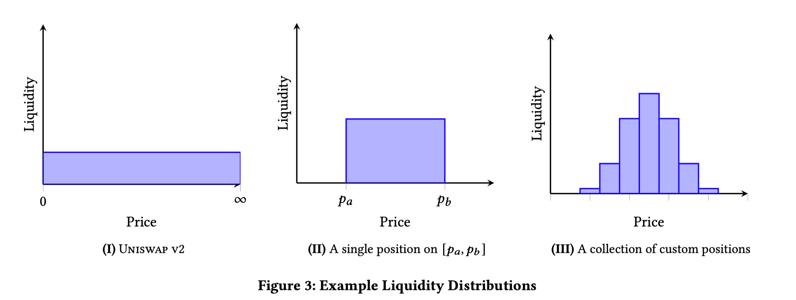
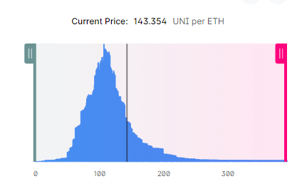

# Understand UniswapV3 whitepaper

> 关于白皮书的解读，已有很多非常棒的文章，但白皮书中的公式和相关概念还是很艰深难懂的，这里我想尝试用比较通俗易懂的方式谈谈对白皮书的理解，希望对大家有帮助。

## xy=k

关于这个 V1 和 V2 版本的核心公式，相信大家已经很熟悉了，（不了解的小伙伴可以看这篇[Uniswap-V1-Like 用 solidity 仿写一个 uniV1](../../../basic/13-decentralized-exchange/uniswap-v1-like/README.md)）。

虽然它是很经典的 AMM 公式，但存在一个很大问题，就是资金利用率不高。

### v2 的价格区间

我们先简单回顾一下在一个流动性池子中，如何表达资产的价格。

假设有资产 X 和资产 Y，现在存在一个以 X 和 Y 资产组成的交易对池子。当我们要用资产 X 来标价 Y 的时候，`PriceY = y的数量 / x的数量`，这很容易想到。

我们在直角坐标系上，用 x 轴表示资产 X 的数量，y 轴表示资产 Y 的数量，那么将上面的式子变换可以得到 `y = p * x`，为了简化，我们用 `p` 来表示 priceY。

于是我们可以在坐标系上添加一条直线，其斜率 `y/x`，就是价格 `p`。当价格变化的时候，就是这条直线的斜率在变化。

流动性就可以用一个矩形的面积来表示。因为`k`的实际意义就是用来衡量一个池子的流动性数量，而`x*y=k`，所以池子中`资产X的数量 * 资产Y的数量 = 流动性数量`。


img01: price changing

在上图中，资产 Y 的价格在上涨，绿色区域的面积是流动性数量 k，需要保持恒定不变，于是随着价格变化，矩形右上方端点（图中的红点）就能划出一条我们熟悉的双曲线。随着价格上涨，红点逐渐上移，矩形的高度不断变大，而宽度不断变小。当价格趋近于无穷大时，红线会无限接近和 y 轴重叠，但却不可能真正重叠，以为绿色的双曲线是不会和坐标轴相交的。所以我们的池子做市的价格上限是无穷大，同理，下限是 0（因为双曲线和 x 轴也不会相交）。

所以在 `x*y=k` 的情况下，做市的价格区间是 (0, ∞)。

### 资金利用率

价格区间(0, ∞)看起来很理想，我们的资金在任何时候（任意价格点）都能为我们赚取手续费。

但我们忽略了另一个影响收益的重要因素，那就是资金的利用率。当一个用户来用我们的池子做交易时，其交易的量相比我们的流动性来说是很小的。

假设现在池子内资产 X 和 Y 都有 8 个，价格 p 为 1。

现在有一笔订单，用 1 个 X 来换取 1 个 Y，我们先不考虑滑点和手续费的影响，这一笔交易为我们带来的手续费收益是 `fee = 1 * 0.3%`，实际参与赚取手续费的流动性就是输出的 1 个 y，这相比于总流动性是很小的，在这一笔交易中，资金利用率是大约是 `1 / 8`。也就是说，我们只需要极少一部分流动性就能承载这一笔交易，而大部分流动性在交易过程中只是躺在那做收益的分母而已……


img02: liquidity rate

回到我们的坐标系上，当用户用 X 换取 Y 的时候，价格会从低点涨到高点，红点从 `p_lower` 移动到 `p_upper` 的过程中，实际参与交易的流动性仅仅是橙色的矩形区域。这里为了便于查看，夸大了价格的变动区间，实际交易过程中，价格变动不会这么大，所以橙色区域是极小的。

所以提高利用率的关键是既要移除那些躺在那不干活的流动性（绿色区域），又要保证这个函数模型不变。于是我们将其换成了虚拟的流动性，即 `x_virtual` 和 `y_virtual`，而添加流动性时，只需要注入橙色区域的流动性即可。于是公式变成了如下模样：

```math
(x + x_virtual)*(y + y_virtual)=k
```


img03: real liquidity

整个图形向左下方平移了，因为价格是直线的斜率，所以平移对于实际交易是没有影响的。**前提是价格没有超出限定的区间**。

正如上图所示，如果价格上涨，超出了 `p_upper`，代表价格的点会来到 y 轴左侧，即这个时候 x 的数量为负数。这是不可能存在的情况，因为在实际情况中，为负的资产数量是没有意义的。所以当我们给池子增加了虚拟流动性之后，我们向其中注入的真实流动性，都只能在特定的价格区间做市，一旦价格超过区间，流动性就枯竭了，或者说，池中其中一种资产的数量变为 0，无法再为市场提供流动性，除非价格再次回到区间内。关于池中资产由 X 全部转换成 Y，这一特性后面我们还会展开讨论，这里先回到资金利用率的问题。

如果你的线性代数不好，可能会被平移的方向绕晕，那么这里我有一个不太恰当的比喻帮助你理解虚拟流动性。回到图 02，你可以想象虚拟流动性就是在 x 轴和 y 轴方向上，给真实的流动性（橙色区域）的两个增高垫，也就是绿色区域补足的部分，帮助我们可以用较少的资金达到原先的做市效果。

事实上，对于使用交易功能的用户来说，v3 的模型和 v2 的模型没有区别，整个价格还是在 `xy=k` 的曲线上运行（把`(x + x_virtual)` 整体当成 x， y 同理）。不论 V2 还是 V3，交易过程中，实际使用的流动性都只是橙色区域，而更多的绿色区域是虚拟的还是真实的流动性，对于他们来说没有区别，观察到的仍是图 02 的模型。

而提供流动性的用户看到的样子，是图 03，在设定的价格区间内，我们解决了资金利用率的问题。

## V3 的核心公式

### 核心公式的推导

V3 的核心公式，其实刚才已经出现了，我们只需要将虚拟流动性具体算出来就好了。为了方便后面的计算，我们将代表流动性的 `k` 换成 `𝐿^2` 即 L 的平方。

现在我们回到图 02，可以看出 `x_virtual` 的长度实际是 `p_upper` 点的 x，而 `y_virtual` 的长度实际上是 `p_lower` 点的 y。所以在确定价格上下区间的情况下，我们可以利用价格的公式 `y = p*x` 和 `xy=L^2` 来换算虚拟流动性的长度。(这里为了变量名称统一，将价格点统一称为 lower 和 upper，白皮书中是 a 和 b，不影响结果。)

将前者代入后者，得到 `p * x^2 = L^2`, 进而就能得到如何用 `L` 和 根号价格 `√p` 表达 `x` 和 `y`：

```math
x = L / √p
y = L * √p
```

于是两个虚拟流动性就可以写为：

```math
x_virtual = L / √p_upper
y_virtual = L * √p_lower
```

核心公式就呼之欲出了：

```math
(x + L / √p_upper) * (y + L * √p_lower) = L^2
```

可以看到，公式中是将 `p_upper` 和 `p_lower` 作为已知的变量，所以在 V3 中添加流动性，是需要用户自己设置需要做市的价格区间的。V3 中创建者不同或者价格区间不同（或手续费水平不同，后面展开讨论）都是不同的流动性头寸 `position`。

> 在 V2 中代表用户提供了流动性的凭证是 ERC20 类型的 LP token （liquidity provider token），因为所有流动性都可以被认为是价格区间为 (0, ∞) 的流动性，因此可以用同质化代币流通。但 V3 中每个流动性可能价格区间都不同，因此需要用 ERC721 类型（NFT）的非同质化代币表示。

需要注意的是，当池子中的交易价格，移动到做市的价格区间之外，我们注入的流动性将不再赚取手续费，也就是未激活状态，而当价格再次回到区间内时，流动性再次变为激活状态。

### 流动性资产的变化

当价格变化时，流动性内的资产 Y 和资产 X 数量会发生变化，在 V2 中这个变化会引起无常损失，而在 V3 中，它的影响会被放大很多倍。因为当价格移动到区间以外的时候，你的流动性头寸中，其实已经变为了单一品种的资产，而另一个资产数量已经清零。


img04: reserves change

观察图中橙色区域的变化可以很容易理解这点，当价格不断上涨，x 的数值是不断减小，直至到达价格上限时，x 完全清零。这一点和 V2 差别很大，其原因就是因为 V3 引入了虚拟流动性。这也是为了提高资金利用率而需要承担的风险。

#### 价格区间的风险与收益

当出现价格在区间以外的情况，此时流动性头寸不但不能继续赚取手续费，同时必定全部变成了单一资产，且一定是当时市场中处于弱势一方的资产。比如当资产 Y 涨价，将会有大量订单用资产 X 从池子中换取 Y，于是池子中的 X 越来越多，而 Y 最终会清零。因为 AMM 自动做市，实际上也是一种被动的做市，永远需要和市场中的订单做对手盘。

也就是说，价格区间越窄，价格移出区间的概率越大，风险越大，而区间越宽，风险就越小。如果你厌恶这种价格移出区间的风险，那么大可直接将价格区间设置为 (0, ∞) ，官方的 UI 界面也支持这个操作，那么你就会得到一个完全没有虚拟流动性，和 V2 差不多的全价格区间流动性了。

当然这么做的代价就是，资金利用率和 V2 也没差别，非常的低。这就相当于你将资金均匀分散到一个很长的价格轴上，虽然每次交易都能赚取手续费，但由于资金在每个价格点上被摊薄的太厉害，导致每次赚取手续费的占比权重非常低。

#### 添加流动性和移除流动性

添加流动性的计算过程，是已知当前价格和输入的其中一种资产数量，计算另一种资产的数量和添加的流动性数量。

V2 中添加流动性，因为价格就是两个资产的比值，所以很容易计算另一种资产数量，然后将两个资产数量相乘就得到了流动性的数量（ `xy=k`）。但 V3 引入了价格区间的概念，使得计算变得比较复杂。

回顾一下刚才计算虚拟流动性的过程，其中我们推导出了如何用 `L` 和 根号价格 `√p` 表达 `x` 和 `y`：

```math
x = L / √p
y = L * √p
```

##### 价格 p 在区间内


img02: 价格在区间内

`p_lower < p < p_upper`

假定添加的流动性是图 02 中的情况，当前价格包含在设定的价格区间内，橙色区域是我们实际需要添加的流动性，虚拟流动性是绿色区域扣除橙色的部分的宽度和高度。

如果我们需要计算橙色部分，为了和上述公式中的 x,y 区分开，我们将橙色部分的宽高称之为 `delta x` `delta y`。`delta x` 就是 `p`（红点） 和 `p_upper` 在 x 轴上的距离， `delta y` 就是 `p` 和 `p_lower` 在 y 轴上的距离。于是我们可以将公式写成这样：

```math
delta x = L / √p - L / √p_upper = L * (√p_upper - √p) / (√p * √p_upper)
delta y = L * √p  - L * √p_lower = L * (√p - √p_lower)
```

再变换一下，改写成求 L（流动性数量）的等式

```math
L = delta x * (√p * √p_upper) / (√p_upper - √p)
L = delta y / √(p - p_lower)
```

`deleta x` 和 `delta y` 就是橙色区域的宽高，在这里我们是已知其中一个的，因为那就是我们输入的其中一种将要注入流动性的资产数量。上面两个等式任意一个就能求得 L，所以不论给定的是 x 的数量，还是 y 的数量，我们都能得到将要添加的流动性数量 L。拿到 L 之后，根据另一个等式可以求得另一个资产的数量。

##### 价格 p 大于区间


img05: 价格 p 大于区间

`p_upper < p`

此时橙色区域已经消失，资产 X 的数量为 0，流动性全部变为资产 Y，其数量就是 `p_upper` 到 `p_lower` 的 y 轴距离，也就是图中的紫色虚线部分。我们根据 `delta y` 求得 `L` :

```math
L = delta y / √(p_upper - p_lower)
```

##### 价格 p 小于区间


img06: 价格 p 小于区间

`p < p_lower`

此时橙色区域已经消失，资产 Y 的数量为 0，流动性全部变为资产 X，其数量就是 `p_upper` 到 `p_lower` 的 x 轴距离，也就是图中的蓝色虚线部分。我们根据 `delta x` 求得 `L` :

```math
L = delta x * (√p_upper * √p_lower) / (√p_upper - √p_lower)
```

##### 移除流动性

移除的过程实际上是上述添加过程的逆运算，也是分三种情况，这里就不赘述。

<br>

**总结一下**:V3 的流动性计算过程是需要先确定价格范围 `p_upper` `p_lower`、当前价格 `p` 和其中一种资产的数量 `delta x`或 `delta y`，求流动性数量 `L` 和另一种资产的数量。

#### 限价单

事实上，这种资产 X 全部转为资产 Y 的特性并不能算是缺陷，反而是一种可以利用的特性。比如当我们与市场看法相反的时候，市场大部分人看好 Y，而你却看好 X（或者看空 Y），于是你故意设置了一个比较窄的价格区间（容易被价格穿过），放在比当前价格高的地方，此时注入流动性，将会全部是资产 Y。当资产 Y 价格上涨时，先进入你的流动性价格区间，不断有人用资产 X 换走你池内的资产 Y，直至价格完全穿过价格区间的上限，池内的资产 Y 被全部换成了资产 X。实际上就是图 04 中展示的过程。


img04: reserves change

回看整个过程，我们在一个价格区间内，完成了资产 Y 到资产 X 的转换，这就是一种变相的限价单功能。和传统的限价单不同的有两点：

- 如果价格不能完全穿过整个价格区间，那么只会有部分资产被转换成另一种资产
- 在转换完成后，请一定要记得将流动性移除，否则当价格再次回到区间内，又会做一次逆向的交易（将资产 X 又换成了资产 Y）

## 交易

在 V2 中，当用户在 UI 界面中填入想要交易的种类和某一方的精确数量（输入或者输出），UI 的就会自动根据 `xy=k` 这个公式本地计算出预估的另一方的数量和交易的滑点。如果去查看 V2 的路由合约 `Route`，就会发现估算交易量的函数 `quote`，实际是一个 `pure` 函数，即仅做纯计算的函数。因为计算过程就是根据池子中两种资产的总量和你的输入（或者输出）等比换算的过程。

```math
amountB = amountA * reserveB / reserveA
```

观察上述 V2 的 quote 公式，你会发现计算数量其实只用查询池子两种资产的总量 `reserveA`, `reserveB`，就能进行换算，而这两个数据是池子合约 `pair` 的 public 属性，是可以直接访问获得的。

而在 V3 的机制里，不可能实现用本地计算估算交易量，因为价格的变动是不确定的。


img07: liquidity distribution

上图中，左边是 V2 的流动性分布，可以看到是覆盖在整个价格轴均匀分布的。中间的是 V3 的单个流动性头寸(`position`)的分部，也就是当一个池子内，只注入了一次流动性的时候的状态，在一个价格区间内，均匀分布。而最右侧，是当很多个流动性叠加后，池内流动性的分布，也就是说因为每笔注入的流动性价格区间不同，他们会有重叠的区域，于是在重叠的区域上，流动性是会叠加的，也就形成了右侧这种不同价格区间内，堆叠高度不同的柱状分布。

当然上述的堆叠图也只是一个示意图，在真实情况的流动性分布，会是如下的样子：


img08: ETH-UNI liquidity distribution

现在假设价格处于一个持续上涨的趋势，当价格开始从左至右穿过这些价格区间时，会不断用一种资产换取另一种资产，而被换出的资产储备是不断减小的，一旦当前价格区间的某种资产被耗尽，价格会穿过当前区间，进入下一个区间，由此产生了价格的变化（因为价格右移了，变大了）。在价格移动消耗池内资产数量的过程中，输入的资产数量也会不断减少，一旦在某个区间输入资产被耗尽，那么价格就会停留在该区间内。

当然只是让价格停留在区间内，是不精确的，这个时候我们就需要借助计算添加流动性推导出来的公式，去反推计算出一个精确的价格（在该价格区间内）。

为了实现上述计算，就必须清楚每一个 `tick` 上的流动性分布，然后像真实交易的过程那样，逐个计算每个 `tick` 区间内流动性是否被耗尽，最后得出交易的价格，才能确认这一笔交易的滑点水平。（UI 界面中并没有这么干，而是很 tricky 的使用了`ethers.staticCall`去模拟调用合约的交易功能，最后在 revert 信息中读取预估数据，这一点感兴趣的同学可以去阅读 interface 的解析部分，这里不展开讨论）。

细心的同学可能发现，刚才的描述中出现了名为 `tick` 的新概念，这就是接下来我们需要深入探讨的问题。

## 手续费

在 V2 中，因为大家提供的流动性都是统一的手续费标准（0.3%），统一的价格区间(0, ∞)，所以大家的资金都是均匀分布在整个价格轴之上的，因此在每一笔交易的过程中，大家收取手续费的权重计算比例也应该是相等的。即每一笔手续费的收益分配，只基于用户提供的流动性相对于总流动性的比例来分配，出资多的得到的收益多，这很好理解。

然而 V3 的价格区间做市机制，让 V2 的分配机制不再公平，因为流动性都有不同的做市区间，也就是说不同的交易价格，使用的流动性是不同的，那么这个时候，再用出资比例来分配，是不合适的。

正确的方式应该是记录每一笔交易，都使用了哪些流动性头寸 `position`，再将这么些头寸汇总，按比例分配。

这样在理论上来说是合理的，如果是中心化的网络这么干的成本可能承受的起，但放到区块链的运行环境中，频繁的进行高昂的读写操作是不可行的，会为用户带来极高的 gas 费用，使得交易的摩擦成本飙升，变得不划算。

我们需要一个节省 gas 的实施方案。

### 离散的价格点 Ticks

优化的第一步，先从价格轴开刀。一个连续的价格轴上，可以拥有无穷多个价格点，因为即使是 (0,1) 这个区间，你都能将其划分成无限多个小数。如果我们在 V3 中仍用连续的价格轴来记录，那将会是一个无限膨胀的 storage 变量。

那么我们确定了第一个条件，价格轴必须是不连续的，即一个个离散的点组成的集合。交易的价格只能限定在这些点之中。

限定价格点，当然会带来价格不精确的问题，毕竟我们将相邻两个点之间的价格都去掉了。为了保证这种精度的误差不至于对交易有过大的影响，我们设置的点的间隔也不能太大，那么就先定为相差 `0.0001` 好了。

于是我们得到了一个差为 `0.0001` 的等差数列。因为 solidity 不支持小数，所以我们决定对这些等差元素进行编号，比如 0.0001 是 1 号， 0.0002 是 2 号...

然后很快你就排不下去了，因为 solidity 最大的整数是 `2^256`，大约在 `1.158e73` 的价格就到头了。看起来上限也足够大了，但我们忽略另一种情况，那就是比公差小的价格，也就是 (0,0.0001) 之间的价格，很多小币值 token 如果和 `btc`, `eth` 组成交易对，都在这个区间。所以等差数列也不太合适。

实际上等比数列虽然表现好点，但问题本身还存在。

我们其实在设置等差或等比数列的时候忽略了一个前提，当价格的值越大的时候，对价格精度的要求会越来越低（想象一下当价格在几万刀的时候，价格的波动会局限于 0.0001 的差距吗？），所以价格的间隔也就没必要那么小。反过来，当价格越小的时候，需要的价格精度也就越高，需要的间隔也就越小。所以我们需要的是一个间隔由极小逐渐增大的数列。

也就是 V3 使用的等幂数列。即：

```math
p(i)=1.0001^i
```

这里的 i 是价格的序号，一个 `int24` 类型（有符号）。当 i 为 0 的时候，价格为 1，这就是价格的基点。当 i 越来越大，其间隔会越来越大，而当 i 越来越小，其间隔会越来越小。这里当 i 为负数时，实际上是对 1.0001 开根号，价格是 (0,1) 区间内的数值。

由于在实际计算过程中使用的不是价格 p 而是根号价格 √p(例如之前流动性与 token 数量的换算中)，我们需要将价格表达调整为：

```math
√p(i)=(√1.0001)^i
```

在 V3 中的价格是从 `(√1.0001)^(int24).min` 到 `(√1.0001)^(int24).max` ，这是一个足够宽广的价格区间，且满足交易中的精度要求。

这里的 `i` 也就是价格的序号，我们称之为 `tick`，而由所有序号组成的集合称之为 `Ticks`。在合约代码中，主要是以 tick 来记录流动性的区间。

### 交易费率水平和 tickspacing

我们已经用等幂数列将连续的价格轴变成了离散的点集合，已经简化了一大步，可惜并不够。因为市场中的交易对，其价格波动的幅度并不是统一的，比如两个稳定币组成的交易对（dai+usdc) 其波动是集中在一个非常小的幅度内的，而如果是两个 AltCoin(山寨币)，那么价格波动可能就非常大。对于波动幅度小的交易对，需要比较密集的价格点来提高精度，而本身波动非常大的交易对，则不需要耗费太多 gas 在密集的价格点计算上，而是比较稀疏的价格点分布。

不仅是价格点的密度需求不同，不同波动幅度的交易对需要的手续费等级也不同。比如稳定币交易对，由于波动非常小，交易产生的价差也不可能太大，如果收取 0.3% 或更高的手续费是不合适的，不利于市场的流动性，而两个山寨币的交易对，由于波动幅度非常大，其产生的价差也可能非常大，即使是 1% 的手续费也有很多人愿意执行交易。

于是 V3 引入了费率三档可选等级和相应的 `tick` 疏密程度，也就是 `tickspacing` 。对于每一种交易对而言，都有三档可选费率等级，0.05%, 0.3%, 1%，并且以后通过社区治理，还有可能永久增加可选的挡位。每种交易费率等级都由给定的 tickspacing，比如稳定币交易对，就是 tick 之间需要间隔 10 个才是有效的可使用的 tick 。位于间隔内的 tick 虽然存在，但程序不会去初始化和使用，也就不会产生 gas 费用。因此，我们在等幂数列的基础上，进一步节省了计算消耗。

V3 设定的费率等级：

| 费率  | tickspacing | 建议的使用范围   |
| ----- | ----------- | ---------------- |
| 0.05% | 10          | 稳定币交易对     |
| 0.3%  | 60          | 适用大多数交易对 |
| 1%    | 200         | 波动极大的交易对 |

### liquidityNet 和 liquidityGross

<!-- tick 上的数据，是描述一个交易池状态基础数据，每一笔交易对价格的影响，对流动性的影响，对手续费的影响，都要从 tick 的数据上操作。 -->

<!-- 想要精确的计算每一个流动性头寸应得的手续费收益，或者说在总收益中所占的权重，就需要精确的记录每个价格点上所具备的流动性数量，和每个价格点所收取的手续费。 -->

这两个是存于 tick 上和流动性相关的数据。

`liquidityGross`: 很好理解，每当有流动性将该 tick 设为价格区间时，不论是价格上限还是价格下限， `liquidityGross` 都会增加。换言之，当 `liquidityGross > 0` 说明该 tick 已经初始化，正在被流动性使用，而 `liquidityGross == 0` 则该 tick 未初始化，没有流动性使用，计算时可以忽略。

`liquidityNet`: 表示当价格穿过该 tick 时，处于激活的流动性需要变化的数量。

在注入或移除数量为 `l` 的流动性时，具体规则如下：

- 注入流动性，tick 是价格下限，`liquidityNet` 增加 `l`
- 注入流动性，tick 是价格上限，`liquidityNet` 减少 `l`
- 移除流动性，tick 是价格下限，`liquidityNet` 减少 `l`
- 移除流动性，tick 是价格上限，`liquidityNet` 增加 `l`

你可能初见此规则，感到很迷惑，为何在注入流动性的时候，`liquidityNet` 有减少的情况，移除的时候反而有增加的情况。其实你需要将这个变量理解为 `delta L`。

在流动性的章节，我们已经说过流动性有激活和非激活两个状态，即价格区间包含当前价格属于激活状态，反之则是未激活状态。那么一个池子内，处于激活状态的流动性数量总是随着价格的变动在变化的。而 `liquidityNet` 记录的就是当价格穿过该 tick 时，需要增加或减少的数量。

举个栗子： 假设现在有两个首尾相连的价格区间(a,b) 和 (b,c)，分别有 1 和 2 的流动性。当价格从 a 点左侧进入 (a,b) 区间，此时池子的激活流动性应该增加 1，那么我们在 a 的 tick 上写入 `liquidityNet += 1` ，当价格走到 b 点，此时已经离开了 (a,b) 区间，池子的激活流动性应该减少 1，所以 b 点的 tick 上写入 `liquidityNet -= 1`。然后进入了第二个区间，池内刚刚减少的激活流动性，又要增加了，于是 b 的 tick 上又写入 `liquidityNet += 2`，直至价格穿过 c 点，池内激活流动性又需要减少 2 ， c 点的 tick 上写入 `liquidityNet -= 2`。

我们需要的是一个可以精确控制池内激活流动性总数的差值，这就是 `liquidityNet` 有增有减的原因。实际上，类似图 08 那样的，在 UI 界面绘制出精确的流动性分布图，就是利用当前池内激活流动性总量和每个 tick 上的 `liquidityNet` 去累加或者累减的结果。

现在知道了 tick 上的流动性分布情况，是不是就能来计算手续费的收益情况了呢？

### 直接累加手续费的方案

现在我们来设计一套手续费的计算方案。既然之前已经拿到了流动性的分布情况，那么每笔交易的进行过程中，我们就能根据相应的交易量，对应相应的流动性头寸，将其产生的手续费数量加上去。

- 一笔交易开始，根据之前交易部分的过程描述，交易会在已有流动性的 tick 之间，逐个进行
- 当价格来到一个 tick 区间内（相邻的两个具有流动性的 tick），我们只要记录这个 tick 区间内的交易量，根据费率算出该区间的总手续费
- 然后找出所有包含该 tick 区间的流动性头寸 `position`，先将他们的数量汇总
- 再根据出资比例逐个分配手续费，将数值累加到待每个头寸的待收取手续费的变量上

这个过程符合直觉，而且逻辑其实并不算复杂。但是**十分消耗 gas**。

先不谈一笔交易可能会横跨很多个 tick 区间，单就一个 tick 区间的计算，就有可能涉及到非常多的流动性头寸 `position`，这不但需要一个耗时的遍历查找的过程，更严重的问题是，每个流动性头寸的待收取手续费肯定是一个 storage 变量，当我们去逐个写入新的数值的时候，gas 费用就起飞了。

上述方案让交易者承担了做市者的 gas 费用，因为记录手续费的分配细节，是做市商们的事务。对于交易者来说，本就承担了手续费，然后还要负责耗费大量 gas 去帮他的对手盘们记录怎么分钱，这肯定不是什么美妙的体验。其实就算是做市商也不会愿意承受。

高昂的 gas 费用是该方案的最大障碍，不得不使用遍历的原因在于分配方案需要保证公平性：

- 在任意区间内，根据出资比例和参与时长保证分配的公平性
- 在不同的价格区间之间，根据出资比例和参与时长保证分配的公平性

如果既要避免高昂的遍历操作，又要保证上述两个公平性，就需要换一种方式。

我们不妨将任务拆分开来实现。

### 相同区间 position 之间的分配

为了简化问题，我们假设这个池子内所有的流动性价格区间都是 (0, ∞)。

对于计算流动性大小的比例（出资比例），不得不在交易过程中去遍历的原因在于，池内所有流动性头寸 `position` ，他们的数量和头寸之间的大小比例是会不断变化的。你无法缓存一个固定的比例，然后在每次交易时按照这个固定的比例分配。

因为流动性头寸可能随时会移除或注入，这个比例是无法保证一直正确的，每次交易都需要遍历计算。

所以我们应该放弃计算流动性大小的比例，转而去计算每单位流动性能够获取的手续费数量（即 1 个流动性产生的手续费收益）。

在提供流动性的用户提取手续费的时候，我们是可以获取他提供的流动性数量的，那么只要将其数量和每单位获取的手续费收益相乘，就是他应得的手续费数量。每单位流动性应得的手续费数量只需要用全局的总手续费除以全局的流动性总量即可。

```math
fee = delta L * (fee_global / liquidity_global)
```

我们设置一个记录全局的每单位流动性赚取手续费的累计值 `feeGrowthGlobal` （注意有 growth，表示它是累计值）。

相关的全局变量有 2 个：

- `feeGrowthGlobal`: 每当有交易发生，就会把每单位流动性赚取的手续费累加到该变量上，这是一个随时间推移单调递增的变量。（这个变量其实有两个，因为手续费的收取是两种资产分别收取的，所以累计的变量也对应了两个。但因为他们的逻辑完全一样，就不分开讲了）
- `liquidity`: 池内当前处于激活状态的总流动性数量。**注意并非是注入的所有流动性总量，而是只计算价格区间包含当前价格的流动性数量，这个变量的含义非常容易误解**。关于 `liquidity` 的更新机制，参考之前的 `liquidityNet` 讲解。

在交易的过程中，有一个相关的局部变量：

- `delta fee`: 交易过程中，每一步产生的手续费数量。具体参见之前的交易过程章节。

我们只需要用 `delta fee` 除以 `liquidity` 就能得到 `feeGrowthGlobal` 每次需要增加的量。

```math
feeGrowthGlobal += delta fee / liquidity
```

对于任意相同价格区间的 `position` （不同用户注入的），只需要在流动性发生变化时（注入或移除），计算这段时间内 `feeGrowthGlobal` 的增量再乘以该 `position` 的流动性数量，就可以知道这段时间内该 `position` 收取的手续费增量。最后将 `position` 内手续费的增量累加起来就是它应得的数量。

**梳理一下**：

- 我们不需要遍历流动性数量算出流动性数量比例，而是去关注每单位收益的增量，当我们需要计算手续费数量时候，乘以流动性数量即可。
- 在 `position` 流动性数量发生变化之前，需要将之前这段时间的手续费增量计算出来，累加记录到相关变量中。（因为流动性数量变化，不能将所有时间段的手续费都以最后的数量来计算）
- 全局的 `feeGrowthGlobal` 是会随着交易进行实时更新的，而 `position` 中的手续费数量不会实时更新，只会在调用 mint 和 burn 这两个会改变流动性数量的函数时触发更新。

### 不同区间之间的分配

我们刚刚解决了同一个区间内的分配方案，或者说是统一的 (0, ∞) 区间。计算过程中使用的是 `feeGrowthGlobal`，当池内出现了不同的价格区间，计算就没办法进行了。因为每个区间对于手续费的贡献不同，我们也不能在全局手续费增加的时候，去计算不同区间之间的比例（和之前一样，遍历会让 gas 飙升）。

我们要如何把 `feeGrowthGlobal` 公平且省 gas 的分配给不同的区间呢？

回顾交易的过程，每当价格移动到某个 tick 上，会不断的消耗其上的流动性，这才是产生手续费的根源。那么，如果我们把每次的手续费增量记录到 tick 上，用户收取手续费的时候再汇总其区间内的所有 tick 数据，是不是就能实现呢？

听起来不错，但依然有问题，因为价格区间内的 tick 也可能非常多，那样就又回到了遍历的问题上。

我们需要打破注意力的局限性，把目光移到价格区间之外，会发现有一种变量是不需要遍历计算的： **区间外的手续费**。

如果我们在收取手续费的时候，能知道区间外的手续费数量，不是就能间接知道区间内的手续费了嘛？这里我们依旧以每单位流动性可收取手续费数量作为累加的增量。

```math
feeGrowthInside = feeGrowthGlobal - feeGrowthOutside
```

假如交易在一个 (a,b) 的价格区间内进行，手续费会在区间内不断累加，但是区间外是一直不变的，即 (0, a) 和 (b, ∞) 区间内的手续费并没有增加。想要计算 (a,b) 区间内的手续费，其实只要用池子内所有流动性赚取的总手续费数量减去区间两边外侧的手续费就行了。

```math
feeGrowthInside = feeGrowthGlobal - feeGrowthOutside_below - feeGrowthOutside_above
```

`feeGrowthOutside_below` 对应 (0, a) 区间， `feeGrowthOutside_above` 对应 (b, ∞) 区间。接下来看看如何去获取这两个的数量。

我们需要在 tick 上新增一个 `feeGrowthOutside` 变量，记录该 tick 作为流动性边界时，区间外的手续费总量。

如果以某个 tick 作为中轴，价格点所在的一侧是内侧，而相对的另一侧是外侧。于是触发其更新的条件其实只有一个：当价格穿过该 tick 时（不论方向左右）。因为只有此时，tick 左右两侧会互换内侧和外侧的定义。

另外当没有流动性将该 tick 作为边界时，我们是不用考虑这个变量的，所以我们将 tick 的初始化放在注入流动性的时候，初始化价格边界对应的两个 tick，而当某个 tick 上流动性重新归零 （`liquidityGross == 0`），我们在计算时可以再次忽略它。

**梳理一下**

假设价格在第 `i_current` 个 `tick` ，对于第 `i` 个 tick 而言

每当有流动性注入的时候，在价格的边界对应的 tick 上有如下初始化规则：

- 当 `i_current < i` 则 `feeGrowthOutside = fee_global`
- 当 `i_current >= i` 则 `feeGrowthOutside = 0`

在交易过程中，`feeGrowthOutside` 有如下更新规则：

- 当价格穿过某个已初始化的 tick 时，该 tick 上的 `feeGrowthOutside` 需要翻转，因为外侧手续费永远要在当前价格的另一侧，固 `feeGrowthOutside = feeGrowthGlobal - feeGrowthOutside`

<br>

有了 tick 上的 `feeGrowthOutside` 变量，区间外两边的外侧手续费就能得出了。

```math
feeGrowthOutside_below = feeGrowthOutside_a // a点所对应的tick的feeGrowthOutside
feeGrowthOutside_above = feeGrowthOutside_b // b点所对应的tick的feeGrowthOutside
```

代入之前的公式

```math
feeGrowthInside = feeGrowthGlobal - feeGrowthOutside_a - feeGrowthOutside_b
```

### V3 手续费的完整流程

现在我们将两个方案连起来，就是 V3 的解决方案了。

1. 首先我们需要记录池子内全局的每单位流动性收取手续费的数量的累加变量 `feeGrowthGlobal`
2. 在每个有流动性的 tick 上记录外侧的手续费数量 `feeGrowthOutside`
3. 对于任意区间，利用公式计算出区间内的手续费总量 `feeGrowthInside`
   ```math
   feeGrowthInside = feeGrowthGlobal - feeGrowthOutside_lower - feeGrowthOutside_upper
   ```
4. 该区间内会存在不同用户注入的不同流动性头寸 `position`，在 `position` 流动性数量发生变化时，累加距离上次变化到现在这段时间的手续费数量增量到 `tokensOwed` 变量（该 positioin 总共可回收的流动性数量）
   ```math
   tokensOwed += feeGrowthInside * liquidity_position (position的流动性数量)
   ```
5. 用户收取手续费，从 `tokensOwed` 中扣除，其他变量不受影响。

> V3 的 position 实际上有两种，一种是 Pool 合约中的（属于底层合约，一般不与用户直接交互），只要价格区间相同，就是同一种 position；而另一种是 PositionManager 合约中的，属于用户交互合约，该合约的 position 会区分不同用户。这里为了描述逻辑的连贯性并没有对两种 position 做区分。感兴趣的小伙伴可以具体参考合约代码部分的解析。

> V2 的手续费计算流程是隐式的，合并在交易和移除流动性的流程中，逻辑比较简单。首先因为所有流动性都有相同的价格区间，再者 V2 没有考虑做市时长的因素，也就是说后注入的流动性会摊薄之前流动性的手续费收益。

## 预言机

V2 的预言机提供了 TWAP (time-weighted average price 时间加权平均价格)，更新时间是每个区块的第一笔交易的价格，其数值是上一次的数值加上当前价格乘以时间差。

```math
a(t) = a(t-1) + price * delta_t
```

外部用户可以通过记录该数值的变化和时间点，获得在一段时间内受短期波动影响较小的时间加权价格。

```math
p(t1,t2) = (a(t2) - a(t1)) / (t2 - t1)
```

上述公式得出了在 t1 到 t2 的时间内，预言机提供的时间加权价格。因为其值是经过时间加权的（累加的是价格乘以时间差），所以受短期波动影响较小，这样能有效防止恶意的价格波动。

V2 的预言机在核心合约上只保留最新的一个值，所以如果外部用户想要使用这个预言机，需要自己搭建一套监控和记录的设施，增加了使用者成本。

V3 相比于 V2 的预言机，有以下较大改动：

1. 相比 V2 累加的是价格的加权数值，V3 累加的是价格的 log 值，即 `log(price, 1.0001)`
2. 在核心合约中增加了存储预言机数值的空间，最大 65536 个数值，至少 9 天的数值，建立监控和记录设施不再是必要条件
3. 增加关于流动性的预言机数值，记录周期和价格一致（每个区块的第一笔交易），其值是当前激活状态的流动性数量的倒数，即 `1/liquidity`

### 算术平均与几何平均

V2 的方式是直接记录价格的累加值，而使用时再除以时间间隔，这就是一种算术平均 (arithmetic mean)。而 V3 累加的是 `log(price, 1.0001)` 也就是价格的幂，使用时再除以时间间隔，这是几何平均 (geometric mean)。

所以使用 V3 的预言机公式需要改成如下:

`a(t)` 是时间 t 时，预言机记录的值（累加价格的 log 值）。

<!-- $$a_t=\sum_{i=0}^tlog(p_i, 1.0001)$$ -->


这里的 log 数值后面其实还有一个 `* 1s` 即以每秒作为时间间隔。然而实际情况中，合约中是以区块的时间戳作为标记时间的，所以合约中的代码跟公式不同。每个区块的头一笔交易时更新，此时距离上一次更新时间间隔肯定大于 1s，所以需要将更新值乘以两个区块的时间戳的差。`tickCumulative` 是 tick 序号的累计值，tick 的序号就是 `log(√price, 1.0001)`。

```math
tickCumulative += tick_current * delta_time
tickCumulative += tick_current * (blocktimestamp_current - blocktimestamp_before)
```

当外部用户使用时，求 t1 到 t2 时间内的时间加权价格 `p(t1,t2)` ，需要计算两个时间点的累计值的差 `a(t2) - a(t1)` 除以时间差。

<!-- $$a_{t2}-a_{t1}=\frac{\sum_{i=t1}^{t2}log_{1.0001}(p_i)}{t2-t1}$$ -->


<!-- $$log_{1.0001}(p_{t1,t2})=\frac{a_{t2}-a_{t1}}{t2-t1}$$ -->


<!-- $$p_{t1,t2}={1.0001}^\frac{a_{t2}-a_{t1}}{t2-t1}$$ -->


使用几何平均的原因：

- 因为合约中记录了 tick 序号，序号是整型，且跟价格相关，所以直接计算序号更加节省 gas。（全局变量中存储的不是价格，而是根号价格，如果直接用价格来记录，要多比较复杂的计算）
- V2 中算数平均价格并不总是倒数关系（以 token1 计价 token0，或反过来），所以需要记录两种价格。V3 中使用几何平均不存在该问题，只需要记录一种价格。
  - 举个例子，在 V2 中如果 USD/ETH 价格在区块 1 中是 100，在区块 2 中是 300，USD/ETH 的均价是 200 USD/ETH，但是 ETH/USD 的均价是 1/150
- 几何平均比算数平均能更好的反应真实的价格，受短期波动影响更小。白皮书中的引用提到在几何布朗运动中，算数平均会受到高价格的影响更多。

> 我在 [oracleCompare.ipynb](./oracleCompare.ipynb) 中简单模拟了算数平均和几何平均的预言机机制，实际结果是算数平均受高价影响较大，而几何平均受低价影响较大。

### 流动性预言机

相比于 V2，任何时刻活跃的流动性就是池子内所有流动性数量总和（因为都是全价格区间），V3 有了不同价格区间，所以不同时刻，激活状态的流动性数量并不是池子内的总流动性数量。为了便于外部使用者更好的观测激活流动性的数量，V3 添加了预言机的 `secondsPerLiquidityCumulative` 变量。

```math
secondsPerLiquidityCumulative +=  delta_time / liquidity {liquidity > 0}
secondsPerLiquidityCumulative +=  delta_time / 1 {liquidity = 0}
```

（因为 liquidity 可能为 0，此时除以 1）

这里的具体含义是每单位流动性参与的做市时长，即一段时间内，参与的流动性越多，那么每单位流动性参与的时长越短，因为分摊收益的流动性数量变多了，反之亦然。

其记录机制和价格逻辑一致，不再赘述。这里介绍一下它的用途。

### Tick 上辅助预言机计算的数据

每个已初始化的 tick 上（有流动性添加的），不光有流动性数量和手续费相关的变量(`liquidityNet`, `liquidityGross`, `feeGrowthOutside`)，还有三个可用于做市策略。

tick 变量一览：

| Type   | Variable Name                  | 含义                                  |
| ------ | ------------------------------ | ------------------------------------- |
| int128 | liquidityNet                   | 流动性数量净含量                      |
| int128 | liquidityGross                 | 流动性数量总量                        |
| int256 | feeGrowthOutside0X128          | 以 token0 收取的 outside 的手续费总量 |
| int256 | feeGrowthOutside1X128          | 以 token1 收取的 outside 的手续费总量 |
| int256 | secondsOutside                 | 价格在 outside 的总时间               |
| int256 | tickCumulativeOutside          | 价格在 outside 的 tick 序号累加       |
| int256 | secondsPerLiquidityOutsideX128 | 价格在 outside 的每单位流动性参与时长 |

outside 的含义参考手续费部分的讲解，这些变量前几个都是手续费部分用到的，最后三个则是预言机相关的数据。

tick 辅助预言机的变量的使用方法：

1. `secondsOutside`： 用池子创建以来的总时间减去价格区间两边 tick 上的该变量，就能得出该区间做市的总时长
2. `tickCumulativeOutside`： 用预言机的 `tickCumulative` 减去价格区间两边 tick 上的该变量，除以做市时长，就能得出该区间平均的做市价格（tick 序号）
3. `secondsPerLiquidityOutsideX128`： 用预言机的 `secondsPerLiquidityCumulative` 减去价格区间两边 tick 上的该变量，就是该区间内的每单位流动性的做市时长（使用该结果乘以你的流动性数量，得出你的流动性参与的做市时长，这个时长比上 1 的结果，就是你在该区间赚取的手续费比例）。

## 参考的文章

- 《Uniswap v3 详解系列》 （paco）: https://liaoph.com/uniswap-v3-1/
