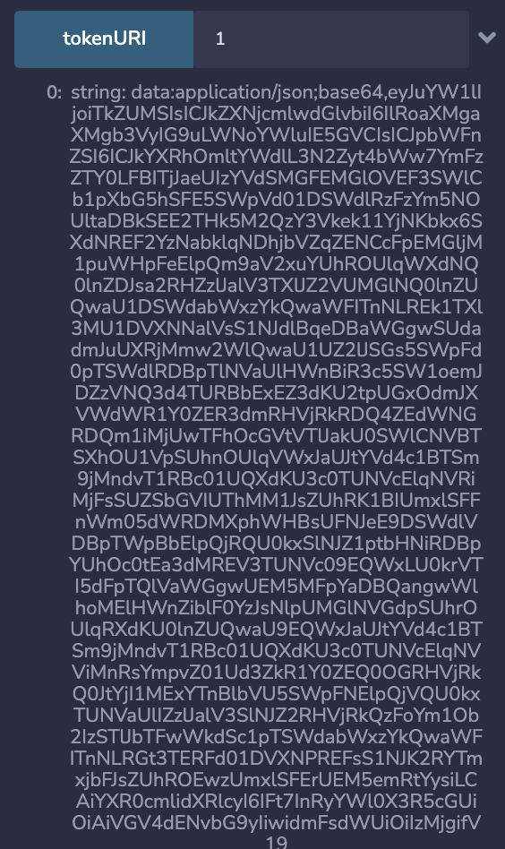
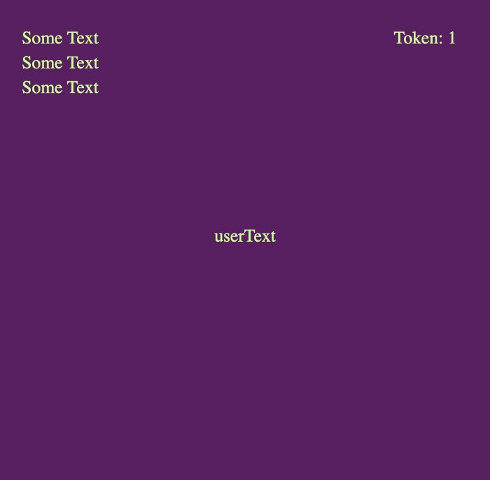
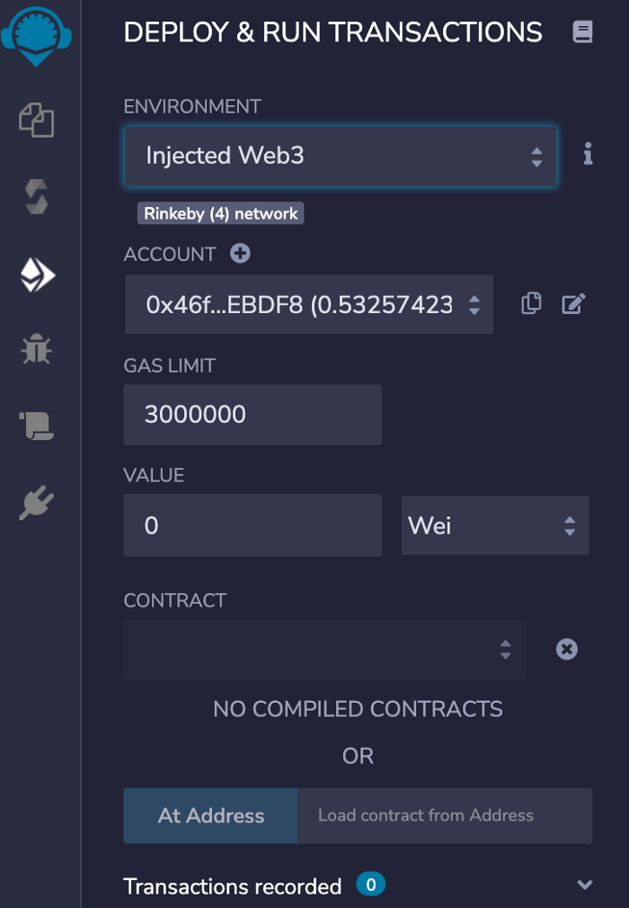

# Loot NFT

## [EmojiLootWithStory合约分析](./EmojiLootWithStory合约分析.md)

## 参考链接

1. https://medium.com/coinmonks/how-to-create-on-chain-nfts-with-solidity-1e20ff9dd87e
2. https://github.com/Park-City-Utah/onChainNFT
3. https://www.youtube.com/watch?v=UBGXFV1TQxc
4. https://www.youtube.com/channel/UC1LV4_VQGBJHTJjEWUmy8nA

## 如何使用 Solidity 创建链上 NFT
将用户内容整合到 NFT 中

### 链下 NFT

 这就引出了一个问题，不是所有的 NFT 都在链上吗？

 嗯，任何在以太坊区块链上从事过 NFT 项目的人都可以告诉你，在链上数据存储方面存在真正的限制；这是非常昂贵的，并且大多数 NFT 项目都将图像和元数据文件存储在链下。

 通常，我们看到存储在“链上”的唯一数据是元数据（我们的 tokenURI）的不可变哈希——描述这个哈希的最简单方法是链接到我们的实际 NFT，这里的区别在于哈希取决于创建它的数据；更改源，哈希不再有效，因此它是不可变的。

 现在，您可能熟悉 Loot 等“链上”项目，那么这是如何完成的呢？我们真的可以在链上存储适当的视觉媒体吗？

 答案是肯定的，但它需要一些东西，即 Base64 编码和 SVG 图像类型。两者都允许我们处理文本数据，而不是典型的内存“重”视觉数据，如 PNG 或 JPEG。

 这意味着我们需要做两件事：
1. Base64 编码我们的 json 元数据
2. 以 SVG 格式编码图像渲染的“指令”

对我们来说幸运的是，浏览器可以理解格式和基于浏览器的市场，例如 OpenSea 可以像链接到 IPFS 存储哈希一样呈现我们的 NFT，但是，浏览器不是“获取和缓存”图像，而是为我们呈现图像.

可以在[此处]([http](https://github.com/Park-City-Utah/onChainNFT))找到实现此目的的代码；Remix将是测试代码的最简单方法。

### Base64 编码

我们可以实现链上元数据存储并避免对任何工具（如 IPFS）的要求的一种方法是对其进行 base64 编码并将其直接存储在我们的 NFT 令牌数据中。您可能熟悉返回给我们的 TokenURI 函数，以及 OpenSea，我们的元数据的哈希值。在我们的例子中，tokenURI 将以编码格式返回实际的元数据；这不再是“链接”，而是元数据本身。

正如我所说，我们将利用 GitHub 中现有的 Base64.sol 库，您可以在此处找到该存储库。您可以从 github 导入或简单地克隆/复制代码并从您粘贴此文件的同一目录中导入此文件。

关于 Base64 编码的说明，编码不是一种数据压缩形式，因此我们不会减少数据的大小，我们只是将其存储为浏览器可以解码的格式。我们的元数据不会太大，我们的 NFT 图像就是这种情况。您可以在下面看到一个示例：


在我们的示例代码中，我们利用函数“BuildMetaData”，它接受一个 tokenId（我们 NFT 的 id）并返回一个 base64 编码的 json 文本字符串，其中包含 OpenSea 渲染 NFT 所需的所有内容，包括其名称、描述、属性，非常重要的是，我们的形象。它还利用了我将在下面解释的 BuildImage 函数。


以下是我们的元数据示例：

```json
{
  "name":"NFT1", 
  "description":"This is our on-chain NFT", 
  "image": "", 
  "attributes": [
    {
      "trait_type": "TextColor",
      "value":"328"
    }
  ]
}
```

通常我们的“图像”值看起来像这样：

```json
{
"image": "ipfs://QmWwMDLz6hQKCqjYba5cSHdrNUvPvAdndtaWjdFpm52GYm/1.gif"
}
```

那么我们的 Image 值怎么了？这看起来也是 Base64 编码的……嗯，你是对的，我们的 Image 值是 1 - SVG 和 2 - SVG 也是 Base64 编码的；这意味着我们的 SVG 文本已经像我们的 json（文本）数据一样被编码。

你会注意到我们在编码的 json 中附加了一些东西，它看起来像这样：

> "data:application/json;base64,"

这仅描述了数据是什么，因此收件人或收件人浏览器如何相应地对其进行解码。

### ABI 编码
您可能注意到我们还在整个项目代码中执行 ABI 编码。在我们的例子中，ABI 编码或应用程序二进制接口将允许我们连接多行文本。“this”、“is”、“my”、“code”如果没有编码成单个字符串，会导致错误。

### SVG 文件
那么什么是 SVG，为什么它对我们很重要？SVG 或可缩放矢量图形本质上允许我们以 xml 类型格式或文本形式存储图像；可以存储在链上的文本。我们不是存储大型图像数据，而是用文本描述我们想要的图像，并以我们的浏览器和 OpenSea 可以为我们呈现的方式对其进行编码。我们可以设置图像的各种特征，包括大小、颜色甚至可以为我们渲染的文本。

这样想，如果我想给你发送一张简单的图片，我可以通过电子邮件或短信给你一个高分辨率的 PNG，或者你可以简单地用几句话描述它，让你的收件人为你呈现或生成它。如果日期或数据传输成本很高，我们可以通过增加接收者的成本（作为努力）来降低成本，从而做出“权衡”。

下面的文本描述可能要少得多，然后是高清 PNG。只要接收者有工具来轻松呈现它，我们就大大降低了数据存储或传输方面的成本：

> “500x500 size blue background with white text saying ‘Hello World’”

我们的示例代码在函数 BuildImage 中描述了 SVG 的参数。

有许多用于 SVG 生成的出色在线工具和模板，我鼓励您找到一些工具来帮助您将想法变为 SVG。

我要建议的一件事是确保您使用百分比进行布局，因为对于应用程序开发，“硬编码”值可能会在我们增加或减少我们渲染的屏幕大小时给我们带来问题。1000 像素作为我们文本的起点可能很好，直到我们将设备的屏幕尺寸减小到 1000x1000 以下，在这种情况下，我们最好将其设置为 80%。

我们的 SVG，在 ABI 和 Base64 编码之前：

```json
'<svg width="500" height="500" xmlns="http://www.w3.org/2000/svg">',
'<rect id="svg_11" height="600" width="503" y="0" x="0" fill="hsl(',
currentWord.bgHue,
',50%,25%)"/>',
'<text font-size="18" y="10%" x="5%" fill="hsl(',
random,
',100%,80%)">Some Text</text>',
'<text font-size="18" y="15%" x="5%" fill="hsl(',
random,
',100%,80%)">Some Text</text>',
'<text font-size="18" y="20%" x="5%" fill="hsl(',
random,
',100%,80%)">Some Text</text>',
'<text font-size="18" y="10%" x="80%" fill="hsl(',
random,
',100%,80%)">Token: ',
_tokenId.toString(),
"</text>",
'<text font-size="18" y="50%" x="50%" text-anchor="middle" fill="hsl(',
random,
',100%,80%)">',
currentWord.value,
"</text>",
"</svg>"
```

我们的 SVG BuildImage 的输出可以在这里看到：


您将再次注意到我们已附加有关数据的详细信息：


### 用户输入

我们的智能合约更有趣的功能之一是用户能够通过将一些文本数据输入到 mint 函数中来为最终的 NFT 做出贡献。此用户输入被保存为“内存字符串”，然后通过 BuildImage 函数动态添加到我们的 SVG 数据中。

我限制了文本输入的大小并为此限制添加了一个错误，但否则用户可以完全了解他们可能添加的内容。这是不可变的，将永远存在于区块链上——这可能会导致一些人想要限制某些词，但根据区块链技术的民主化性质，我没有设置进一步的限制或审查。

我们的 mint 函数只需在函数上添加字符串期望即可实现此功能：

```
function mint(string memory _userText) public payable {
    uint256 supply = totalSupply();
    bytes memory strBytes = bytes(_userText);
    require(strBytes.length <= stringLimit, "String input exceeds limit.");
    require(exists(_userText) != true, "String already exists!");
    
    Word memory newWord = Word(
        string(
            abi.encodePacked(
                "NFT",
                uint256(supply + 1).toString()
            )
        ),
        "This is our on-chain NFT",
        randomNum(361, block.difficulty, supply).toString(),
        randomNum(361, block.timestamp, supply).toString(),
        _userText
    );

    if (msg.sender != owner()) {
        require(msg.value >= 0.005 ether);
    }

    wordsToTokenId[supply + 1] = newWord; //Add word to mapping @tokenId
    _safeMint(msg.sender, supply + 1);
}
```

### 与我们的 NFT 和智能合约交互
如果您使用的是 Remix 等工具，您可以简单地更改提供的代码，将其上传到 Remix，编译并部署以进行测试。

由于我们的 mint 函数需要用户输入字符串数据，因此您将能够添加文本，然后利用我们的 tokenURI 函数来查看生成的内容，这与 OpenSea 等市场将利用来检索或解析我们的 NFT 数据和图片。



那么我们该怎么做呢？要在您的浏览器中呈现它，您需要复制“字符串”之后的所有内容（我们不需要这个）并将其粘贴到我们的浏览器中。将其粘贴到我们的浏览器中的结果将如下所示：


此外，我们可以通过复制“image”值来查看我们的图像，我们要复制的部分在这里突出显示：


结果可以在这里看到：


### 我们的 NFT

有了这个，我们创建了一个智能合约，允许用户在铸币时输入文本，生成包含我们用户输入的 SVG 数据，将其编码为 Base64，并将其添加到我们也是 base64 编码的元数据中。结果，链上 NFT 将呈现在 OpenSea 等市场中：



### 关于REMIX的说明
如果您选择在 Remix 上测试您的代码，您可能会发现在尝试运行 tokenURI 时遇到超时错误——这是由于在线 JVM 的限制，只需将“环境”设置切换为“Injected Web3”即可解决'。我个人将 Rinkeby 测试网与我的 Metamask 浏览器钱包一起使用。您将需要 Rinkeby 测试网 Eth 来获取来自Rinkeby测试代币。

Rinkeby 是一种很好的测试方式，成功的铸币实际上意味着你可以在[Rinkeby OpenSea](https://rinkeby.opensea.io/) 实例上查看你的 NFT ，本质上是 OpenSea 的克隆。
祝测试愉快！

 
### 视频
对于非常相似的代码的极其详细的演练，尽管在mint中没有用户输入功能，请查看以下 [youtube视频](https://www.youtube.com/watch?v=UBGXFV1TQxc)并关注 [Hashlips](https://www.youtube.com/channel/UC1LV4_VQGBJHTJjEWUmy8nA) 的频道，您将在其中找到各种优秀的 NFT 内容。
